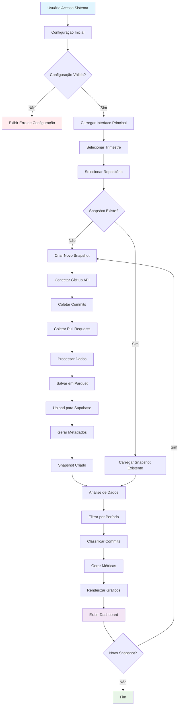
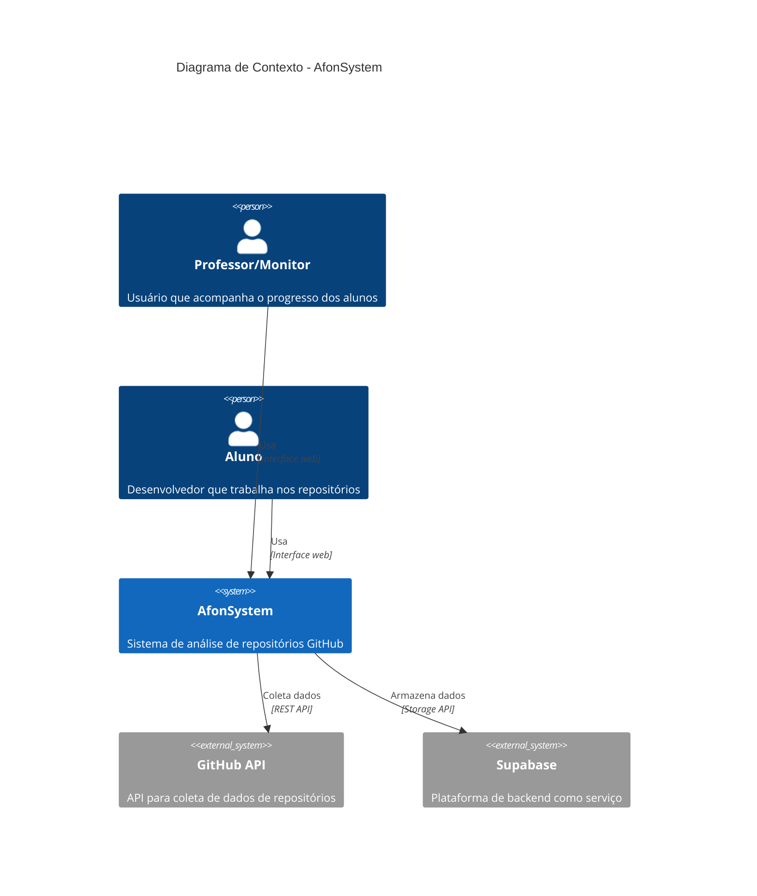
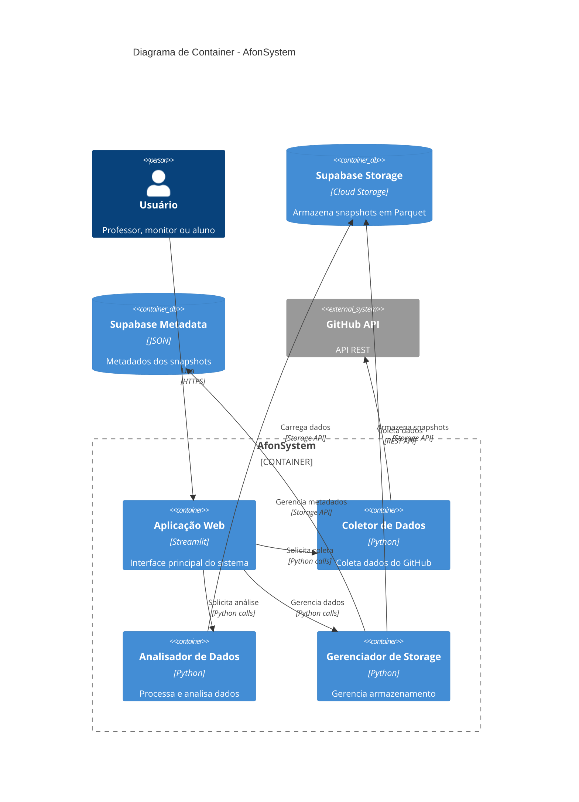
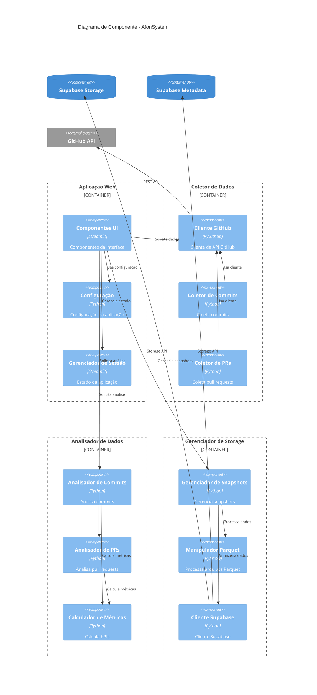
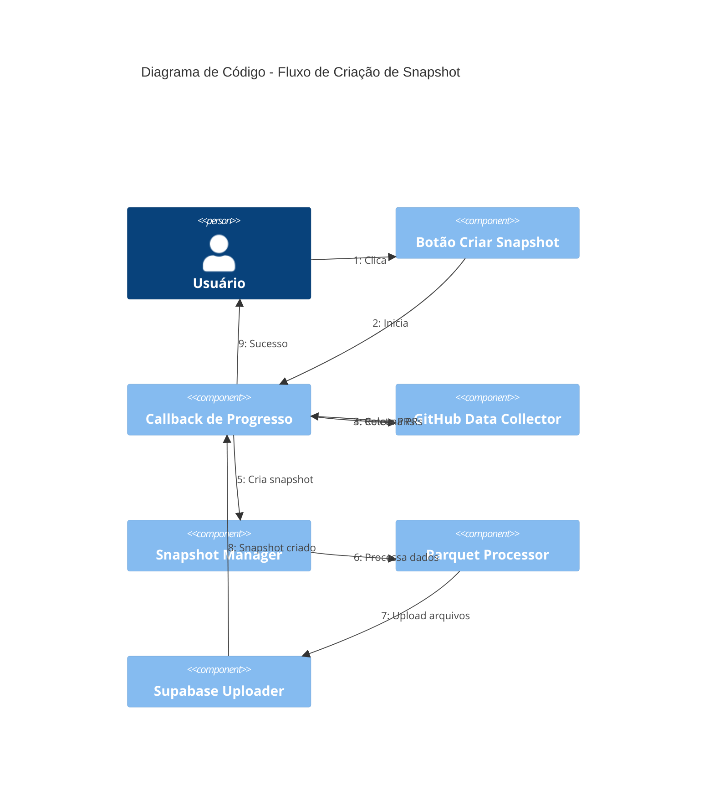

# AfonSystem - Sistema de Análise de Repositórios GitHub

[](https://www.python.org/downloads/)
[](https://streamlit.io/)
[](https://supabase.com/)
[](LICENSE)

## 📋 Índice

- [Visão Geral](#visão-geral)
- [Arquitetura do Sistema](#arquitetura-do-sistema)
- [Fluxograma de Funcionamento](#fluxograma-de-funcionamento)
- [Modelo C4](#modelo-c4)
- [Requisitos Funcionais](#requisitos-funcionais)
- [Requisitos Não Funcionais](#requisitos-não-funcionais)
- [Instalação e Configuração](#instalação-e-configuração)
- [Uso](#uso)
- [Contribuição](#contribuição)
- [Licença](#licença)

## 🎯 Visão Geral

O AfonSystem é uma aplicação web desenvolvida em Python que permite coletar, armazenar e analisar dados de repositórios GitHub. Especialmente projetado para acompanhar o progresso de alunos em projetos de desenvolvimento, o sistema fornece métricas detalhadas sobre commits e pull requests através de uma interface interativa.

### 🚀 Principais Funcionalidades

- **Coleta Automática**: Dados coletados automaticamente via GitHub API
- **Armazenamento Eficiente**: Dados armazenados em formato Parquet no Supabase
- **Análise Inteligente**: Classificação automática de commits por tipo
- **Visualização Interativa**: Gráficos e dashboards em tempo real
- **Organização por Trimestres**: Estrutura organizacional por períodos acadêmicos
- **Análise Individual**: Métricas detalhadas por aluno

## 🏗️ Arquitetura do Sistema

### Tecnologias Utilizadas

| Tecnologia | Versão | Propósito |
|------------|--------|-----------|
| **Python** | 3.8+ | Linguagem principal |
| **Streamlit** | 1.28+ | Interface web |
| **GitHub API** | v3 | Coleta de dados |
| **Supabase** | Cloud | Armazenamento |
| **Pandas** | 2.0+ | Manipulação de dados |
| **Plotly** | 5.0+ | Visualizações |
| **Pydantic** | 2.0+ | Validação de dados |
| **PyArrow** | 12.0+ | Formato Parquet |

### Estrutura do Projeto

```
afonsystem/
├── app.py                 # Aplicação principal
├── helpers/              # Módulos auxiliares
│   ├── app_config.py     # Configuração
│   ├── data_collector.py # Coleta GitHub
│   ├── supabase_helper.py # Integração Supabase
│   ├── snapshot_manager.py # Gerenciamento snapshots
│   ├── data_analysis.py  # Análise de dados
│   ├── ui_components.py  # Componentes UI
│   └── analytics_service.py # Serviços analíticos
├── models/               # Modelos de dados
│   ├── snapshot.py       # Modelos snapshot
│   ├── commit.py         # Modelos commit
│   └── pull_request.py   # Modelos PR
├── repositories/         # Camada de dados
├── tests/               # Testes automatizados
├── requirements.txt     # Dependências
└── README.md           # Documentação
```

## 🔄 Fluxograma de Funcionamento



## 🏛️ Modelo C4

### Nível 1: Diagrama de Contexto



### Nível 2: Diagrama de Container



### Nível 3: Diagrama de Componente



### Nível 4: Diagrama de Código (Fluxo de Dados)



## 📋 Requisitos Funcionais

### RF01 - Gestão de Repositórios
- **RF01.1**: O sistema deve permitir configurar múltiplos repositórios GitHub
- **RF01.2**: O sistema deve validar a existência e acessibilidade dos repositórios
- **RF01.3**: O sistema deve organizar repositórios por trimestres acadêmicos

### RF02 - Coleta de Dados
- **RF02.1**: O sistema deve coletar automaticamente todos os commits de um repositório
- **RF02.2**: O sistema deve coletar automaticamente todos os pull requests de um repositório
- **RF02.3**: O sistema deve armazenar metadados completos (autor, data, mensagem, URL)
- **RF02.4**: O sistema deve fornecer feedback em tempo real durante a coleta

### RF03 - Criação de Snapshots
- **RF03.1**: O sistema deve criar snapshots pontuais dos dados coletados
- **RF03.2**: O sistema deve gerar identificadores únicos para cada snapshot
- **RF03.3**: O sistema deve armazenar snapshots em formato Parquet
- **RF03.4**: O sistema deve manter metadados de cada snapshot

### RF04 - Análise de Commits
- **RF04.1**: O sistema deve classificar commits automaticamente por tipo (feat, fix, docs, etc.)
- **RF04.2**: O sistema deve calcular métricas por tipo de commit
- **RF04.3**: O sistema deve permitir filtrar commits por período
- **RF04.4**: O sistema deve analisar padrões temporais de commits

### RF05 - Análise de Pull Requests
- **RF05.1**: O sistema deve analisar o estado dos pull requests (aberto/fechado)
- **RF05.2**: O sistema deve identificar autores de pull requests
- **RF05.3**: O sistema deve calcular métricas de participação em PRs
- **RF05.4**: O sistema deve gerar timeline de criação de PRs

### RF06 - Análise Individual
- **RF06.1**: O sistema deve permitir análise individual por aluno
- **RF06.2**: O sistema deve calcular métricas específicas por autor
- **RF06.3**: O sistema deve comparar performance entre alunos
- **RF06.4**: O sistema deve identificar padrões de atividade individual

### RF07 - Visualização de Dados
- **RF07.1**: O sistema deve gerar gráficos de pizza para distribuição de tipos
- **RF07.2**: O sistema deve gerar gráficos de linha para evolução temporal
- **RF07.3**: O sistema deve gerar gráficos de barras para comparações
- **RF07.4**: O sistema deve exibir tabelas com dados detalhados

### RF08 - Interface do Usuário
- **RF08.1**: O sistema deve fornecer interface web responsiva
- **RF08.2**: O sistema deve permitir seleção de trimestres
- **RF08.3**: O sistema deve permitir seleção de repositórios
- **RF08.4**: O sistema deve permitir seleção de snapshots
- **RF08.5**: O sistema deve fornecer filtros de data

### RF09 - Gestão de Dados
- **RF09.1**: O sistema deve permitir listar snapshots existentes
- **RF09.2**: O sistema deve permitir carregar dados de snapshots
- **RF09.3**: O sistema deve permitir excluir snapshots
- **RF09.4**: O sistema deve manter histórico de snapshots

### RF10 - Relatórios
- **RF10.1**: O sistema deve gerar relatórios de progresso
- **RF10.2**: O sistema deve identificar alunos com baixa atividade
- **RF10.3**: O sistema deve calcular tendências de desenvolvimento
- **RF10.4**: O sistema deve exportar dados para análise externa

## ⚡ Requisitos Não Funcionais

### RNF01 - Performance
- **RNF01.1**: O sistema deve carregar dados em menos de 5 segundos
- **RNF01.2**: O sistema deve processar até 10.000 commits por snapshot
- **RNF01.3**: O sistema deve suportar até 100 repositórios simultâneos
- **RNF01.4**: O sistema deve responder a requisições em menos de 2 segundos

### RNF02 - Escalabilidade
- **RNF02.1**: O sistema deve suportar crescimento linear com o número de repositórios
- **RNF02.2**: O sistema deve permitir armazenamento ilimitado de snapshots
- **RNF02.3**: O sistema deve suportar múltiplos usuários simultâneos
- **RNF02.4**: O sistema deve permitir expansão horizontal

### RNF03 - Confiabilidade
- **RNF03.1**: O sistema deve ter disponibilidade de 99.5%
- **RNF03.2**: O sistema deve implementar tratamento de erros robusto
- **RNF03.3**: O sistema deve validar dados antes do armazenamento
- **RNF03.4**: O sistema deve fornecer logs detalhados de operações

### RNF04 - Segurança
- **RNF04.1**: O sistema deve proteger tokens de acesso do GitHub
- **RNF04.2**: O sistema deve validar permissões de acesso aos repositórios
- **RNF04.3**: O sistema deve implementar autenticação segura
- **RNF04.4**: O sistema deve criptografar dados sensíveis

### RNF05 - Usabilidade
- **RNF05.1**: O sistema deve ter interface intuitiva e fácil de usar
- **RNF05.2**: O sistema deve fornecer feedback visual claro
- **RNF05.3**: O sistema deve ser responsivo em diferentes dispositivos
- **RNF05.4**: O sistema deve ter documentação clara

### RNF06 - Manutenibilidade
- **RNF06.1**: O código deve seguir padrões de qualidade
- **RNF06.2**: O sistema deve ter cobertura de testes de 80%
- **RNF06.3**: O sistema deve ter documentação técnica completa
- **RNF06.4**: O sistema deve permitir atualizações sem downtime

### RNF07 - Compatibilidade
- **RNF07.1**: O sistema deve funcionar em navegadores modernos
- **RNF07.2**: O sistema deve ser compatível com Python 3.8+
- **RNF07.3**: O sistema deve funcionar em Windows, Linux e macOS
- **RNF07.4**: O sistema deve ser compatível com diferentes resoluções

### RNF08 - Eficiência
- **RNF08.1**: O sistema deve usar armazenamento otimizado (Parquet)
- **RNF08.2**: O sistema deve implementar cache inteligente
- **RNF08.3**: O sistema deve minimizar transferência de dados
- **RNF08.4**: O sistema deve otimizar consultas de dados

### RNF09 - Interoperabilidade
- **RNF09.1**: O sistema deve integrar com GitHub API v3
- **RNF09.2**: O sistema deve integrar com Supabase
- **RNF09.3**: O sistema deve permitir exportação de dados
- **RNF09.4**: O sistema deve suportar APIs REST

### RNF10 - Portabilidade
- **RNF10.1**: O sistema deve ser deployável em diferentes ambientes
- **RNF10.2**: O sistema deve usar variáveis de ambiente para configuração
- **RNF10.3**: O sistema deve ser containerizável
- **RNF10.4**: O sistema deve funcionar em cloud e on-premises

## 🚀 Instalação e Configuração

### Pré-requisitos

- Python 3.8 ou superior
- Conta no GitHub com token de acesso
- Projeto Supabase configurado
- Git instalado

### Instalação

1. **Clone o repositório**
   ```bash
   git clone https://github.com/seu-usuario/afonsystem.git
   cd afonsystem
   ```

2. **Crie um ambiente virtual**
   ```bash
   python -m venv venv
   source venv/bin/activate  # Linux/Mac
   # ou
   venv\Scripts\activate     # Windows
   ```

3. **Instale as dependências**
   ```bash
   pip install -r requirements.txt
   ```

4. **Configure as variáveis de ambiente**
   ```bash
   cp .env.example .env
   # Edite o arquivo .env com suas configurações
   ```

### Configuração

1. **GitHub Token**
   - Acesse: https://github.com/settings/tokens
   - Crie um novo token com permissões: `repo`, `read:user`
   - Adicione ao arquivo `.env`:
     ```
     GITHUB_TOKEN=seu_token_aqui
     ```

2. **Supabase**
   - Crie um projeto em: https://supabase.com
   - Crie um bucket chamado `afonsystem`
   - Configure as políticas de acesso
   - Adicione ao arquivo `.env`:
     ```
     SUPABASE_URL=sua_url_aqui
     SUPABASE_ANON_KEY=sua_chave_aqui
     ```

3. **Repositórios**
   - Adicione ao arquivo `.env`:
     ```
     REPO_NAMES=owner/repo1,owner/repo2,owner/repo3
     ```

### Execução

```bash
streamlit run app.py
```

O sistema estará disponível em: http://localhost:8501

## 📖 Uso

### Primeiro Acesso

1. **Selecione o trimestre** (ex: 2025-1B)
2. **Selecione o repositório** desejado
3. **Clique em "Criar Snapshot"** para coletar dados
4. **Aguarde a conclusão** da coleta
5. **Selecione o snapshot** criado para análise

### Análise de Dados

1. **Visualize os KPIs** gerais do snapshot
2. **Use o filtro de sprint** para períodos específicos
3. **Analise os gráficos** de distribuição e evolução
4. **Selecione um aluno** para análise individual
5. **Explore os pull requests** e suas métricas

### Funcionalidades Avançadas

- **Comparação entre snapshots**: Selecione diferentes snapshots
- **Análise temporal**: Use filtros de data para sprints
- **Exportação de dados**: Use as tabelas para exportar dados
- **Identificação de padrões**: Analise tendências nos gráficos

## 🤝 Contribuição

1. **Fork** o projeto
2. **Crie** uma branch para sua feature (`git checkout -b feature/AmazingFeature`)
3. **Commit** suas mudanças (`git commit -m 'Add some AmazingFeature'`)
4. **Push** para a branch (`git push origin feature/AmazingFeature`)
5. **Abra** um Pull Request

### Padrões de Código

- Use **Python 3.8+** syntax
- Siga **PEP 8** para formatação
- Adicione **docstrings** para funções
- Escreva **testes** para novas funcionalidades
- Use **type hints** quando possível

### Estrutura de Commits

- `feat`: Nova funcionalidade
- `fix`: Correção de bug
- `docs`: Documentação
- `style`: Formatação
- `refactor`: Refatoração
- `test`: Testes
- `chore`: Manutenção

## 📄 Licença

Este projeto está licenciado sob a Licença MIT - veja o arquivo [LICENSE](LICENSE) para detalhes.

## 📞 Suporte

- **Issues**: [GitHub Issues](https://github.com/seu-usuario/afonsystem/issues)
- **Documentação**: [Wiki](https://github.com/seu-usuario/afonsystem/wiki)
- **Email**: suporte@afonsystem.com

## 🙏 Agradecimentos

- **Streamlit** pela plataforma de desenvolvimento web
- **GitHub** pela API robusta
- **Supabase** pelo backend como serviço
- **Comunidade Python** pelas bibliotecas utilizadas

---

**Desenvolvido com ❤️ para facilitar o acompanhamento de projetos de desenvolvimento**
